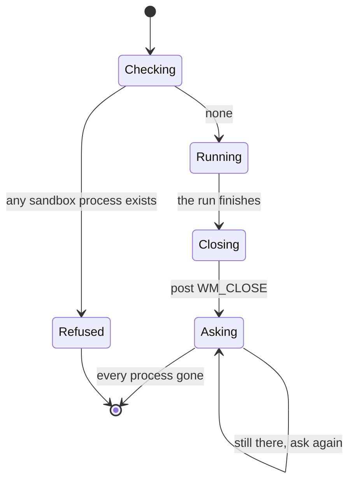
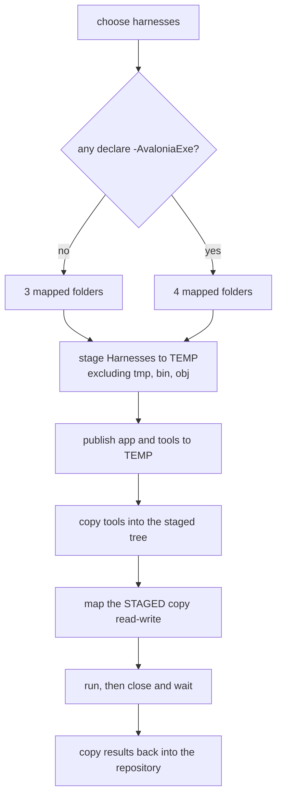

# Running UI-automation harnesses in Windows Sandbox

*An account of making Windows Sandbox a working environment for UI Automation tests, written while
doing it in a WPF-to-Avalonia port from 2026-09-05. "Here" means that port, on that machine, and the
scripts and commits it names are the port's.*

---

*The companion to [SharedDesktopHarnessJournal.md](SharedDesktopHarnessJournal.md), which covers the
other half. **This one is about input isolation; that one is about everything else** — how to run a
harness on the machine somebody is using when it sends no input, which most of them do not, and why
a sandbox is the wrong tool for that job.*

---

## The problem this solves

The port has thirty-seven runtime harnesses: PowerShell scripts that start the real application
and assert on what it actually does through UI Automation. They exist because the compiler and the
unit suite are both blind to a whole class of defect in a desktop application - a dead binding, an
unresolved resource, a command wired to nothing. A green unit suite is not evidence the feature
works, and the port has the scars to prove it: one feature shipped with thirty-six passing tests
and did not work at all.

Nine of those harnesses sent **real keystrokes and mouse input** when this was written; one has
since been converted to UI Automation and sends neither. That input goes to whatever has the
foreground, which means the standing rule has always been: do not run them while somebody is at
the machine. One harness's input once went into a browser window. So the full suite of runtime proof could only be
run when the owner was away, and work that depended on it queued up behind that.

Windows Sandbox is a disposable Windows desktop in a window, with **its own session**. Input sent
inside it cannot reach the desktop the owner is typing on. That is the whole idea.

## What the sandbox does not have

A fresh sandbox is a clean Windows image. Two absences matter, and both were solved without ever
enabling networking:

| Missing | Supplied by |
|---|---|
| PowerShell 7 (the image has 5.1) | Mapping the host's own install read-only |
| .NET, of any version | Publishing the application self-contained |

The PowerShell trick is the pleasing one. A normal `C:\Program Files\PowerShell\7` install is
**self-contained** - it carries `hostfxr.dll` and its own runtime, about 226 MB - so mapping that
folder read-only into the sandbox and running `C:\pwsh\pwsh.exe` gives you a full PowerShell 7 with
no installer, no download, and networking switched off.

The application goes in the same way: `dotnet publish -r win-x64 --self-contained true`, about
173 MB for a WPF app, mapped read-only. The compiled input helper the harnesses use has to be
published self-contained too, because those harnesses rebuild it with `dotnet build` when it is
missing and there is no compiler in there to do it.

## The trick that avoided editing thirty-three scripts

Every harness finds the application the same way:

```powershell
Join-Path (Split-Path -Parent $PSScriptRoot) "Source\App\bin\Debug\net10.0-windows\App.exe"
```

The obvious approach is to give every script an `-Exe` parameter. Thirty-three edits, and every
script then knows about the sandbox.

The better approach is to **give the sandbox the shape the scripts already expect**:

| Host folder | Sandbox path | |
|---|---|---|
| the host's PowerShell 7 install | `C:\pwsh` | read-only |
| the self-contained publish | `C:\repo\Source\App\bin\Debug\net10.0-windows` | read-only |
| the repository's `Harnesses` folder | `C:\repo\Harnesses` | read-write |

`$PSScriptRoot` is then `C:\repo\Harnesses`, its parent is `C:\repo`, and the path each script
computes for itself resolves to the published build. Windows Sandbox creates a mapped folder at a
nested path that does not exist in the image, so the deep path costs nothing.

**Not one harness was edited.** The proof was to run one that takes no `-Exe` argument at all,
unmodified, and watch it pass.

Results come back through the same read-write mapping, into the folder the harnesses already write
their samples to. Nothing needs to be copied out.

> **SUPERSEDED, 2026-09-16 — the third row of that table is no longer the repository.** Mapping
> `Harnesses/` directly made the one writable mapping a folder the editor, git and the desktop
> application were all watching, and the publish wrote 283 MB into it before the sandbox even
> started. A staged copy goes to `%TEMP%` instead and results are copied back afterwards. The
> *trick* is unchanged — the guest is still given the shape the scripts expect, so still not one
> harness was edited. See **THE STANDARD APPROACH** at the end of this document.

## The lifecycle, which is where it all goes wrong

This is the part worth reading if you are going to try it, because every rule below was learned by
breaking it.



**One sandbox runs on a machine at a time.** A second launch is refused by a dialog box, which a
script cannot read - so the script has to check first and refuse in its own words. The first two
attempts failed exactly here, because an earlier sandbox had been left open and the cleanup
matched process names that do not exist.

**Never force-kill it.** `Stop-Process` on the sandbox server leaves `vmmemWindowsSandbox` behind,
and that leftover keeps its sessions to the host's folder-sharing service. The next sandbox then
starts to a **black screen** reading *"An attempt was made to establish a session to a network
server, but there are already too many sessions established to that server"*, with no mapped
folders and its logon command never run. Nothing tells you why. That cost two launches to work out.

**Ask it to close, and keep asking.** Posting `WM_CLOSE` once is not enough: after the guest has
run `shutdown /s /t 0`, the client ignores the message for a while. One posted here was still being
ignored four minutes later; the identical message posted again closed it in thirty seconds. So the
close helper posts on every pass of its poll.

**Wait for every process, including the VM.** `vmmemWindowsSandbox` is the last to go, and starting
the next run before it has gone is what produces the black screen above.

## What it costs

| | |
|---|---|
| Launch to the logon command running | about 10 seconds |
| Teardown, closed properly | 14 to 30 seconds |
| Teardown, after a force-kill | 116 seconds, and it poisons the next launch |
| A self-contained publish of the app | about 173 MB |

Because startup and teardown are cheap but not free, and because only one sandbox runs at a time,
the right shape is **one session for the whole suite** rather than one sandbox per harness.

> **STILL TRUE, AND THE FIGURES BELOW IT ARE NOT.** One session per harness was built on 2026-09-16
> and was a mistake twice over — it took the host down, and it cost **91 to 129 seconds a session**
> rather than the forty-five this table's neighbours imply, which is about double the batch it
> replaced. But *"one session for the whole suite"* has not been re-established either: the largest
> staged run so far is two harnesses. See **THE STANDARD APPROACH** at the end of this document.

## What it is not for

**Performance measurement.** A virtual machine says nothing about processor time or GPU behaviour
on the real machine. The port has locked decisions resting on host measurements, so the runner
refuses its performance harness *by name*, out loud, rather than skipping it quietly.

## Dogfooding

Four runs on 2026-09-05. All thirty-two harnesses in one sandbox session while the owner carried on
using the machine; then three of them with the sandbox window deliberately brought to the front, to
test the first hypothesis the big run raised; then one on its own to test the second; then the
seven input-driven harnesses together, unfronted, which is the one that actually settled it. The
counts below are the full run.

| | |
|---|---|
| Passed | 20 |
| Failed | 5 |
| Inconclusive | 7 |
| Wall clock, all thirty-two | 21 minutes, one sandbox, teardown in 18 seconds |

**Nothing touched the owner's settings folder, and nothing reached the owner's desktop.** That much
worked exactly as designed, and it is the floor the rest of this rests on.

Two questions the plan had listed as unknown were answered, both favourably:

**Screen capture works.** Three harnesses capture the window with `PrintWindow` and count coloured
pixels - ANSI colour handling, quiet-period rules, scrollbar hit marks. All three passed. This was
the single thing most likely to make the approach useless for a third of the suite.

**A window larger than the desktop is fine.** The sandbox desktop was 1139x669. The column harness
seeds a window 1624 pixels wide and passed, because UI Automation reports an element's full
rectangle whether or not it is clipped.

### Everything that differed, and why

Five failures and seven inconclusives sorted into four causes, none of which was a defect in the
application.

**1. A harness that shells out to a tool the image does not have.** `verify-encoding` builds its
Cyrillic sample by invoking `python`, and failed in three seconds with *"The term 'python' is not
recognized"*. Not really a sandbox problem: the host has only the Windows Store aliases for
`python`, which print an install prompt rather than running anything, so that dependency is
unsatisfied in both places. The sandbox is what made it visible.

**2. A harness the runner called wrongly.** `verify-rowspan` declares `-Exe` as a *mandatory*
parameter rather than defaulting to the build beside it, so it failed in two seconds without
running anything. That is a bug in the runner, not a property of sandboxes. It now asks each script
whether it has an `Exe` parameter and supplies the mapped build if so, which fixes any future
harness that gains one.

**3. Everything is drawn at exactly twice the size.** This is the substantial one. Three harnesses
that assert absolute pixel measurements failed, and the numbers are unmistakable:

| Measurement | Sandbox | Expected |
|---|---|---|
| Row pitch, Consolas 12 | 40 | 20 |
| Row pitch, Consolas 24 | 80 | 40 |
| Row pitch, 1.5x line spacing | 60 | 30 |
| Row pitch, 0.8x line spacing | 32 | 16 |

Exactly double, every time. It is **not** a missing font - the harness reports Consolas by name and
its metrics scale correctly relative to each other. A DPI-unaware probe inside the sandbox reports
96 dots per inch and "100% scaling", which is consistent with the guest actually rendering at 200%
while telling a DPI-unaware caller the unaware value.

The practical rule that falls out of it: **assertions about ratios and relative change survive a
sandbox; assertions about absolute pixel counts do not.** The harnesses that compare a measurement
against another measurement all passed. The ones that compare against a number written into the
test all failed. That is a reasonable thing to know about your own suite regardless of sandboxes.

**4. The foreground, and only the first harness gets it.** This is the category that decides how
much of the input suite can live here, and it took three runs to read correctly. The first two
readings were both wrong, which is instructive enough to keep - see below.

Input-driven harnesses reported INCONCLUSIVE, their own guard working correctly:

> the window could not be brought to the foreground (`GetForegroundWindow()`=131958); no keystroke
> is delivered in that state

**The rule, established by running the input harnesses on their own:**

| Position in the session | Result |
|---|---|
| First input harness | takes the foreground, clicks land, keys arrive |
| Every one after it | cannot take the foreground |

It matches the big run exactly. There, `verify-alert` was the first input harness and passed;
`verify-clear-shortcut` was the second and failed; every input harness after that was inconclusive.
In a session of seven input harnesses run back to back, the first got the foreground and the other
six did not.

The mechanism follows from the diagnostic this added: **at the start of a sandbox session nothing
holds the foreground at all** - `GetForegroundWindow()` returns 0, an idle session. The first
application to start can take it. When that application exits the foreground goes back to nothing,
and `SetForegroundWindow` called from a freshly launched helper process cannot claim it, because
Windows only grants that to a process which already owns the foreground or inherits the right from
one that does. The helper is a new process every time, launched by a PowerShell that the logon
command started **without a console window of its own** - so there is no chain of foreground rights
to inherit.

That is a fixable thing rather than a property of sandboxes, and the fix is the standard one:
`AttachThreadInput` to the thread that currently owns the foreground before calling
`SetForegroundWindow`, which is how automation tools have always got around this restriction. It
would help on the host too, where the same restriction is why a harness must not be started from a
window that then loses focus.

### Getting this one wrong twice

Worth showing, because the wrong readings were both plausible and both would have been published.

**First reading: "input harnesses need the sandbox window in front."** Seven inconclusives, all
input-driven, while the sandbox window sat behind other work - so the guest's foreground must
follow the host window's focus. It was tested by fronting and maximising the sandbox, and the
keyboard harness passed. Confirmation, apparently.

It was confirmation of the wrong variable. Fronting the sandbox also made it the *first* input
harness of a fresh session, which is the thing that actually mattered. And the test itself took over
the whole screen, which is precisely what a sandbox is for avoiding - the owner of the machine said
so, and was right to.

**Second reading: "the runner's console needs the foreground."** Having realised the guest might be
the problem rather than the host, the next guess was that the logon command's PowerShell console
held the foreground and would not give it up. The instrumentation written to prove it disproved it
in one line: *this runner has no console window of its own*.

What settled it was running the input harnesses **on their own, unfronted, in one session** - a
cheap experiment that neither earlier reading had thought to do, because both had an explanation
they liked. The result was unambiguous and neither explanation survived it.

### The foreground fix, and what it uncovered

`tools/Input`'s `foreground` verb now escalates instead of asking once: a plain
`SetForegroundWindow`, then an Alt press to lift the foreground lock, then `AttachThreadInput` to
join this thread's input queue to the target window's and to whoever holds the foreground, and
finally the old minimise-and-restore. Threads sharing an input queue share the right, which is the
standard way around the restriction and the one that works when the foreground belongs to nobody.

**It works.** All seven input harnesses run back to back, unfronted, now report *"the window holds
the foreground"*. Before the change the first one did and the other six gave up.

That removed the barrier and revealed what was behind it. With the foreground no longer in doubt,
the input harnesses sort cleanly by **what kind of input they send**:

| Input | Reaches the application in a sandbox |
|---|---|
| Plain keystrokes - Home, PageUp, PageDown, arrows, a bare letter | **yes** |
| Mouse clicks and drags - a line is selected, a range is dragged | **yes** |
| Modifier chords - Ctrl+L | **no**, and the same harness's bare `L` works |
| Mouse wheel, with or without Shift | **no**, nothing moves |
| Copy to the clipboard | reads back **empty** |

The keyboard-navigation harness passes outright. The clear-shortcut harness passes its bare-letter
assertion and fails its Ctrl+L one in the same run, which is about as clean a discrimination as
this kind of thing offers.

Everything in the "no" column goes through `keybd_event` and `mouse_event` - the legacy input
functions - while the plain key and click paths that work go through the same helper but are
simpler messages. The obvious next step is `SendInput`, which is the supported modern API and is
documented to behave better where the legacy calls are filtered. That has not been tried yet.

The clipboard is a separate question again: the run has `ClipboardRedirection` disabled, which may
disable the guest's own clipboard rather than only its sharing with the host. Enabling it is not
obviously right - a harness copying lines would then overwrite the clipboard of whoever is using
the machine, which is the sort of intrusion this whole exercise exists to avoid.

### SendInput did not help, and the clipboard was never the problem

`tools/Input` now sends everything through `SendInput` rather than `keybd_event` and `mouse_event`,
with a chord going in a single batch that nothing can interleave with. That is the supported modern
API and the obvious suspect, and it made **no difference at all**:

| | legacy calls | `SendInput` |
|---|---|---|
| Plain keystrokes | arrive | arrive |
| Clicks and drags | arrive | arrive |
| Ctrl+L | ignored | ignored |
| Shift+wheel, plain wheel | nothing moves | nothing moves |

The clear-shortcut harness passes its bare `L` assertion and fails its Ctrl+L one under both. The
change is kept, because `SendInput` is what Microsoft documents and the legacy functions are a
compatibility shim, but it is not the answer and pretending otherwise would be worse than saying so.

**The clipboard turned out to be a red herring**, and one probe settled it. Asked directly, inside
the guest, with redirection still disabled:

> the guest clipboard works: what was set came back

So the empty clipboards were never a sandbox clipboard limitation. Copying in this application is
**Ctrl+C** - a modifier chord - so the two harnesses that read back nothing were failing for exactly
the same reason Ctrl+L fails. One question, not two, and the probe cost one line of output.

That leaves a single unexplained behaviour rather than four: **a Windows Sandbox delivers plain
synthesized keystrokes and plain synthesized clicks, and silently drops anything that involves a
held modifier or the wheel.** Both APIs, foreground held, window focused, session active. Why is not
established here, and the honest position is that it is not known rather than that it is understood.

### What this means in practice

**Twenty-five of the thirty-two run unattended**, behind whatever you are working on: everything that
reads the automation tree, measures geometry, captures the screen, counts pixels, tails files, and
drives the application with plain keystrokes. That is the bulk of the value and it works today.

**Six are blocked on one unexplained behaviour** - the modifier and wheel one above. They are not
blocked on the sandbox being unusable, on focus, on the clipboard, or on the input API. If that one
thing is ever solved they all come back at once.

**Three had their assertions changed**, and are better for it on any machine: they hard-coded pixel
counts read off one display, and now measure the pitch and express the rest against it. All three pass in a sandbox on its doubled numbers.

**One had its Python dependency removed** and now passes for the first time in either place: it shelled out to a script neither the sandbox nor the host could run, and .NET carries the code page.

**Two more depend on UI state** the sandbox seems not to reach - an inline-viewer toggle that never
appears - which has not been investigated and may be nothing to do with sandboxes at all.

### A mistake worth recording

The first version of the runner wrote every run into one results folder and cleared it on the way
in. The three-harness experiment therefore destroyed the transcripts of the thirty-two harness run
it was investigating, an hour after they were produced. Runs now go into a folder named for when
they started and nothing is ever cleared.

### The Apps key gets a command in where a chord cannot (2026-09-07)

The owner ruled on 2026-09-07 that the six input harnesses should move to UI Automation patterns —
the second of the three ways forward listed under *Open questions* below. Applying it to the first
of them turned up a hard limit and a way round it, and they are different shapes of thing.

**The limit: a pattern cannot stand in for a gesture.** `verify-shift-select.ps1` proves
shift-clicking, and `SelectionMonitor` asks the real keyboard through `IKeyboardModifiers`:

```csharp
public bool IsShiftDown =>
    Keyboard.IsKeyDown(Key.LeftShift) || Keyboard.IsKeyDown(Key.RightShift);
```

`SelectionItemPattern.AddToSelection` sets `IsSelected` and carries no modifier state, so the
monitor takes its plain-add branch and the shift-range code is never entered at all. A converted
harness would stay green on a build with the feature ripped out, which is worse than no harness. So
**that one stays host-only and input-driven, and it is the one of the six the decision cannot
reach** — the other five use a modifier as a means to an end, while its subject *is* the modifier.

**The way round, for a command rather than a gesture: the Apps key.** `VK_APPS` (93) is a plain
keystroke, which a sandbox delivers perfectly well, and it opens the focused element's
`ContextMenu`. The menu item is then an ordinary automation element with `InvokePattern` on it. So
**anything reachable from a context menu is reachable in a sandbox**, which is a wider door than it
looks: in this application Copy, Clear and Un-Clear all live there, and Copy is otherwise guarded by
Ctrl+C alone. `verify-selection-survives-scroll.ps1` reads the clipboard this way, in here, where
`chord ctrl 67` is dropped on the floor — and it passes.

Two details it cost, both worth carrying:

- **The context menu is its own top-level window.** Searching the application's window for the
  `MenuItem` finds nothing at all. Search from `RootElement`.
- **`SetFocus` on a `ListBoxItem` selects it.** The first run of that harness came back with the
  line under test *and the new top row beside it*, because the harness focused the top row before
  sending the key — it was changing the selection it was measuring. Removing that one call removed
  the extra row and changed nothing else, which is what says it was the cause. The list takes the
  focus once, before the selection is made, and nothing focuses anything afterwards. **A harness
  that focuses a row in order to send it a key has already moved the thing it came to read.**

## Open questions

- ~~**Why a sandbox drops held modifiers.**~~ **Answered on 2026-09-08: it does not, or no longer
  does.** Replicated across two harnesses and three modifiers — see the section above. What remains
  open is *why the 09-05 finding held then*, and the hypothesis on offer is `19148d3`, the
  foreground fix of 09-06, after which none of the input harnesses were re-run in a sandbox. Nobody
  needs the answer to make progress; it is written down so it is not re-derived.
- ~~**Whether the wheel arrives.**~~ **Answered on 2026-09-08: it does.** All four assertions of
  `verify-shift-wheel.ps1` pass in a sandbox, both directions and both negative controls. See the
  section above.
- **What the suite actually scores in a sandbox now.** The counts in *Dogfooding* are from 09-05,
  when the input harnesses could not deliver their input. Three have been seen to pass since; the
  rest have not been re-run. **Do not quote the old numbers as current** - run the suite and count.
- ~~**Whether UI Automation's own patterns are a way round it.**~~ **Ruled on 2026-09-07: yes, and
  with one exception.** See the section above. `Invoke`, `Toggle`, `Scroll` and `SelectionItem` do
  not go through synthesized input at all, and the Apps key opens a context menu for the commands
  that a chord otherwise guards. The exception is a harness whose subject *is* a modifier gesture -
  `verify-shift-select.ps1` - which stays host-only. What remains open is the other four:
  `verify-shift-wheel.ps1` is a gesture too and probably cannot move; `verify-clear-shortcut.ps1`,
  `verify-partial-selection.ps1`, `verify-inline-clear.ps1` and `verify-truncate.ps1` have not been
  looked at yet.
- **Why an inline-viewer toggle never appears in there**, which is the last difference with no
  hypothesis attached to it.
- **Whether the 2x scaling can be turned off.** Converting the affected assertions to ratios is
  done for two harnesses and worth finishing regardless, since it improves them anywhere.
### The ruling reaches two of the six, not four (2026-09-08)

Reading the remaining four settled which of them the UI Automation ruling can actually take, and the
answer is smaller than the list suggested. **The test is not whether a harness sends input. It is
whether the input is the harness's subject or merely its means.**

| Harness | What it asserts | |
|---|---|---|
| `verify-shift-select.ps1` | a shift-**click** selects the whole range | the modifier is the subject |
| `verify-shift-wheel.ps1` | Shift+wheel scrolls sideways and a bare wheel does not | the modifier is the subject |
| `verify-clear-shortcut.ps1` | **Ctrl+L** empties the view and a bare **L** does not | the modifier is the subject |
| `verify-partial-selection.ps1` | a **drag** across the pane copies part of a line | the gesture is the subject |
| `verify-inline-clear.ps1` | the context **menu** reads `Copy \| Clear \| Un-Clear`, and Clear works from it | the right-click is a means |
| `verify-truncate.ps1` | the prompt appears, **Cancel holds the focus**, Escape cancels, confirming empties | the clicks are means |

The first four stay host-only, and the reasons are worth being exact about rather than lumping them
together as "they need input".

**`verify-clear-shortcut.ps1` is the sharpest case, and it is the one most likely to be converted by
mistake.** Invoking the Clear command through `InvokePattern` would be easy and would pass, and it
would prove nothing the unit suite does not already prove. The harness exists because *a `KeyBinding`
whose command does not resolve fails silently* - the port's most repeated lesson - so the key
binding is the entire subject. Its discriminating half is that a **bare L does nothing**, which no
pattern can express at all.

**`verify-partial-selection.ps1` has a tempting near-miss.** `TextPattern` can select a range without
a mouse, so a converted harness would put thirty characters of a hundred-and-thirty on the clipboard
and go green. What it would have proved is that the pane *supports* a text selection, not that
dragging across it *makes* one - and #133 is a request about dragging.

The two that do convert lose something real, and the harnesses say so at their heads rather than
leaving it implied: `verify-truncate.ps1` no longer proves that a right-click opens the menu, and
`verify-inline-clear.ps1` would not either. Neither ever asserted it.

**`verify-truncate.ps1` is converted and passes in a sandbox**, all nine assertions, on 2026-09-08.
The right-click became the Apps key, the menu item and both buttons became `InvokePattern`, and
Escape stayed as it was because it is the subject of the guard rather than a way of reaching one.
The list is focused rather than a row, for the reason the entry above gives.

**This is the one that most wanted to run unattended.** It is the only feature in the application
that destroys data, and until now the honest claim was *"the truncation works"* rather than *"the
guard works"* - the assertions that Cancel holds the focus when the prompt opens, and that Escape
dismisses it with every byte still there, had only ever run on a host with somebody waiting for the
machine back. They run in a sandbox now.

### The Show inline toggle: it was never the toggle (2026-09-08)

`verify-inline-clear.ps1` and `verify-inline-selection.ps1` never saw the *Show inline* toggle in a
sandbox, and that was the last difference on the list with **no hypothesis attached to it**. It has
one now, and it is not about the toggle at all.

Both harnesses created their user-defined search by typing it: `ValuePattern.SetValue` on the search
box, then a real click, then a real Enter - *"committed with a real Enter, because the box's own
InputBinding is what adds the search"*. `verify-inline-display.ps1`, written 2026-09-06, instead
**seeds** the search into `StateBucket.setting` so the application comes up with it already
selected. Run in a sandbox on 09-08, that one reached the toggle, opened the viewer and reported the
application faithfully - three assertions green and its one deliberate red failing with the same
numbers it gives on the host.

So the seeding was ported into both. `verify-inline-clear.ps1` then **passed in a sandbox, all six
assertions**, with the lower list's menu reading `Copy | Clear | Un-Clear`.

**The attribution is clean, and worth spelling out because it could easily have been muddled.** That
harness was converted in two ways at once - seeded search, and right-click replaced by the Apps key.
Only one of them can explain the toggle, because the toggle is reached *before* the menu step ever
runs. Same harness, one relevant variable changed, absent becomes present.

**What is still not known is which half of the typed path fails in a sandbox** - whether the click
does not focus the box, the `SetValue` does not stick, or the Enter does not reach the box's
`InputBinding`. Nothing here isolated that, and nothing needed to.

### And an observation that contradicts this document (2026-09-08)

`verify-inline-selection.ps1`, seeded the same way, was run in a sandbox to check the seeding half -
the expectation being that it would reach the viewer and then fail at Ctrl+C, which is what this
document says a sandbox does to a chord.

**It passed. Every assertion, including the Ctrl+C and the shift-click.**

```
after one click:   copied 1
after a second click on the same row: copied 1
after shift-click three rows down: copied 1, 2, 3, 4
```

That is a chord and a held modifier both delivered, in a sandbox, in one run. It contradicts *What
is red, and why* and the *Open questions* below, which have rested since 2026-09-05 on a sandbox
silently dropping anything with a modifier held.

**It is one observation and it is not written up as a finding.** The replication attempt -
`verify-clear-shortcut.ps1`, whose whole subject is Ctrl+L against a bare L, and
`verify-shift-wheel.ps1` - **hung the host machine** and had to be recovered by restarting it. That
run got as far as isolating its settings and no further, so it settled nothing. Nothing was left
behind afterwards: no orphaned `vmmemWindowsSandbox`, no cleanup needed.

**What this would change if it replicates**, which is why it is worth someone's time: the four
harnesses whose subject is a gesture would not need converting *or* keeping host-only. They could
run in a sandbox exactly as they are. That is a better outcome than either branch of the
2026-09-07 ruling, and it makes the *host-only* half of that ruling wrong while leaving the *do not
convert them* half exactly as it was - those are two separate claims and only one is in doubt.

**Do not simply re-run those two together.** That combination is what the machine went down on. If
this is picked up, run one harness, alone, and watch it.

### Replicated: a sandbox delivers held modifiers (2026-09-08)

The observation above is not a one-off. `verify-clear-shortcut.ps1`, run alone in a sandbox at 4 GB:

```
PASS  a bare L leaves the view alone
PASS  Ctrl+L empties the view
PASS  the file itself is untouched
```

**That is the harness whose failure is this document's own anecdote** - *"Ctrl+L did nothing while a
bare L worked"* - and it now passes with the negative control intact, which is what makes it a
statement about the modifier rather than about clearing. Two independent harnesses, three different
modifiers between them (Ctrl+C, Shift and a click, Ctrl+L).

**So the finding of 2026-09-05 does not hold today.** It is left standing above, marked, rather than
deleted: how it was arrived at is the part worth keeping, and it was not carelessly arrived at - the
counts were real and the conclusion followed from them.

**What most likely changed, offered as a hypothesis and not as a finding.** `19148d3` on 2026-09-06 -
*fix: the input helper can take the foreground when nobody holds it* - altered how the helper
acquires the foreground, and **the input harnesses were never re-run in a sandbox after it.** Both
runs above print *the window holds the foreground* before sending anything. If that is the answer
then the 09-05 finding was correct when it was made and has been fixed since by a change nobody
connected to it, which is a more ordinary story than the alternative and fits the dates. Testing it
would mean reverting that commit in a scratch build, which nothing yet needs.

**Still untested: the wheel.** The original claim was *modifiers and the wheel*, and only the
modifier half has been re-examined. `verify-shift-wheel.ps1` covers both at once - Shift with the
wheel moves the list sideways, a bare wheel moves it down - so it is the single run that would
settle the remainder.

**What this changes.** The 2026-09-07 ruling had two halves and only one of them survives:

| | |
|---|---|
| *Do not convert the four whose subject is a gesture* | **stands** - a pattern-driven version would go green while proving less |
| *Therefore they are host-only* | **wrong** - two of the four now demonstrably run in a sandbox as they are |

Converting them was never the way to get them running unattended. Running them was.

**On the hang.** The run that took the host down was two input harnesses in one session at the
default 8 GB. A single harness at 4 GB completed in 39 seconds and the sandbox was gone 16 seconds
later. That is not an explanation and should not be read as one - one clean run does not locate a
fault - but it is the difference between the two attempts, and until somebody knows better, **run
one at a time**.

### And the wheel (2026-09-08)

`verify-shift-wheel.ps1`, alone in a sandbox, passes all four of its assertions:

```
PASS  Shift+wheel moves the view sideways
PASS  Shift+wheel does not move the view down
PASS  a plain wheel notch moves the view up
PASS  a plain wheel notch does not move the view sideways
```

Both directions and both negative controls, which is what stops it going green on a build that
ignores the key. **That is the other half of the 2026-09-05 claim, and it is the whole of that
finding superseded**: this sandbox delivers held modifiers and the wheel.

**What follows for the project.** The blocker that shaped a week of work is gone. Nothing is
host-only for want of input any more; `measure-cpu.ps1` stays out by decision, because a virtual
machine says nothing about processor time, and that is a different kind of reason.

**What does not follow.** Three input harnesses have been seen to pass in there -
`verify-inline-selection.ps1`, `verify-clear-shortcut.ps1`, `verify-shift-wheel.ps1` - and the rest
have not been re-run since 09-05. *The blocker is gone* is an observation; *they all pass now* is
not, and the counts in the Dogfooding section above are still the old ones. Re-run them before
quoting a number.

## The whole suite, green, unattended (2026-09-08)

Thirty-six harnesses in one sandbox session, **all thirty-six passing**, in twenty-nine minutes
while the owner used the machine. That is the thing this document was started to make possible, and
it is worth putting beside the run it began with.

| | 2026-09-05 | 2026-09-08 |
|---|---|---|
| Passed | 20 | **36** |
| Failed | 5 | 0 |
| Inconclusive | 7 | 0 |
| Wall clock | 21 min, 32 harnesses | 29 min, 36 harnesses |

**Almost none of that gap was the sandbox.** Working back through it:

- **Seven inconclusive and several failures were input never arriving** - the modifiers and the
  wheel. That was fixed at some point before 09-08 and nobody noticed, most likely by `19148d3`;
  the sections above have the evidence and the hypothesis. `verify-partial-selection.ps1` passing
  here says a **drag** arrives too, which nothing had tested since.
- **Four were harnesses that were wrong** - `verify-encoding.ps1` shelling out to a `python` that
  exists in neither place, and three measuring against pixel counts read off one display. Repaired
  2026-09-05.
- **Two were application defects the harnesses had found** and which have since been fixed: upstream
  #104's regression, and the inline viewer numbering every row as the line before it. Both were red
  here on purpose, and both are green in this run because the code changed, not because the harness
  did.

So the honest reading of *20 to 36* is not that the sandbox got better. It is that a suite nobody
could run unattended was accumulating three different kinds of red at once, and running it is what
told them apart.

**What it costs to know this**: one command, twenty-nine minutes, and the machine stays usable
throughout.

---

## The host went down again, and "run one at a time" was already written down (2026-09-15)

**A forty harness session at the default 8 GB hung the host machine, which had to be rebooted.**
The run reached the fourth harness — `look-wordwrap.ps1`, a WPF one — and stopped. Nothing was left
behind: no `WindowsSandboxRemoteSession`, no `WindowsSandboxServer`, no orphaned application process, and
the working tree was intact afterwards.

**This is the second time and the rule was already here.** *Replicated: a sandbox delivers held
modifiers (2026-09-08)* ends with: *"The run that took the host down was two input harnesses in one
session at the default 8 GB... until somebody knows better, run one at a time."* That was read as
advice about the two input harnesses which had caused it. **It is not — it is about batch size**,
and the session that hung today was not running an input harness when it went.

**What today adds, because it is the first time both outcomes happened on one day at one setting:**

| Session | Memory | Outcome |
|---|---|---|
| 38 harnesses | 8 GB (default) | completed, 34 minutes, 38 of 38 |
| 1 harness, three times | 8 GB (default) | completed, 42 to 45 seconds each |
| **40 harnesses** | **8 GB (default)** | **took the host down at the fourth** |

So a large batch is not reliably fatal and is not reliably safe, which is the worst of the two and
the reason this is worth a section. **The difference between the two batches was two extra harnesses
and one extra mapped folder** — the Avalonia publish, 208 MB, added by stage 5b step 6. That is a
candidate and **not** a finding: the run died three harnesses before anything touched it, and a 38
harness batch had already succeeded that morning with the same 8 GB and one fewer mapping.

**What to do until somebody knows better.**

- **`-Only` is cheap and is the right default habit.** A single harness publishes, runs and tears
  down in about forty-five seconds. Three of them in a row today cost two minutes and answered more
  than the batch would have.
- **Do not start a full-suite run without saying so first.** It occupies the machine for half an
  hour and may take it entirely, and the person at the keyboard should get to decide that.
- **The machine is not short of anything.** 60 GB of RAM and 2.5 TB free at the time. Raising
  `-MemoryMB` is not obviously the answer and lowering it is what the 2026-09-08 note happened to
  observe; neither has been tested against a batch.

**What is unproved because of it**: whether the extra mapped folder disturbs the 38 harnesses that
were green that morning. Step 6 is proved by `verify-avalonia-shell` alone — green, and seen red by
altering the palette — and by nothing wider.

## The host went down a THIRD time — at four harnesses, not forty (2026-09-16)

**A four harness run took the host down and it had to be rebooted.** Four, not forty, and each one
in **its own sandbox session** — which was the arrangement built that morning specifically to stop
this happening. It made things worse rather than better, and the evidence it left behind points at
something neither of the previous two entries suspected.

### What was run, and what it cost

`Harnesses/tools/sandbox/Run-Plan.ps1`, new that morning: one sandbox session per harness, driven by
a plan file rewritten to the host after every one, so an interrupted run could be resumed. The
reasoning was that a single-harness session is the only shape this machine has never failed at, and
that sequencing was never the variable — `Run-Harnesses.ps1` already walks `to-run.txt` with a plain
`foreach`, so the forty harness batch of 2026-09-15 was *already* strictly one at a time.

| Session | Harness | Verdict | Seconds |
|---|---|---|---:|
| 1 | `verify-alert.ps1` | PASS | **160.2** (includes the publish) |
| 2 | `verify-ansi.ps1` | PASS | **91.4** |
| 3 | `verify-columns.ps1` | PASS | **129.2** |
| 4 | `verify-avalonia-shell.ps1` | — | **the machine hung** |

**THE "ABOUT FORTY-FIVE SECONDS" FIGURE IN *WHAT IT COSTS* IS WRONG FOR THIS SHAPE, AND THE WHOLE
ECONOMIC ARGUMENT RESTED ON IT.** Measured here: 91 and 129 seconds for the two sessions that skipped
the publish. At a mean of 110 seconds, **forty sessions is about 73 minutes, not the 30 that was
claimed** — so one-session-per-harness is roughly **twice** the wall clock of the 34 minute batch
rather than the same. It buys resumability at double the cost, and that is the honest trade.

### What the plan file bought, which is the one thing that worked

**The 2026-09-15 crash left nothing behind. This one left a precise record**, because the plan is
written to the host after every session: three PASS with their timings and their transcript folders,
and the fourth still `pending`. That is the difference between "half an hour bought nothing" and
"three done, here is exactly where it stopped". **Keep that property in whatever replaces this.**

### The fourth session is the interesting part

`run-20260916-092856/verify-avalonia-shell.txt` contains **one line**:

```
driving the AVALONIA build at C:\repo\Source\App.Avalonia\bin\Debug\net10.0\App.Avalonia.exe
```

`run.log` ends at `09:29:38  running verify-avalonia-shell.ps1`. The host was gone by 09:30, and the
System log carries `Kernel-Power 41` — rebooted without shutting down cleanly. **No bugcheck (1001)
and no GPU TDR (4101)**, which is what a hard hang rather than a driver reset looks like.

**The next line that harness prints is `window W x H at X,Y`, and it comes BEFORE the `PrintWindow`
call.** It never printed. So the hang happened while the application was **starting and drawing its
first frame** — not during the capture.

*The caveat, stated rather than glossed: the transcript is a redirected file and a buffer that never
flushed could hide a line. The first line did reach disk, which argues for per-write flushing and so
for the missing line genuinely never running, but it is not proof.*

### What changed since `verify-avalonia-shell` last ran in a sandbox safely

**THERE IS A CONTROLLED COMPARISON ON DISK AND IT IS UNUSUALLY CLEAN.** The same harness ran in the
sandbox twice on 2026-09-15, and both sessions completed:

```
run-20260915-134215  window 1016 x 739 at 1532,162   centre pixel #FF454545   PASS
run-20260915-134331  window 1016 x 739 at 1532,162   centre pixel #FF123456   FAIL  (the seen-red check)
run-20260916-092856  <one line, then the host hung>
```

**Same harness, same sandbox settings, same window geometry, and the application started and
rendered fine — twice.** So "the Avalonia application starts in the sandbox" is *established*, and it
is **not** what broke. What changed is what the application *draws* once it is up:

| | 2026-09-15, both sessions fine | 2026-09-16, the host hung |
|---|---|---|
| `MainWindow` | **empty by design** | hosts `LinesView` over a real file |
| Drawn | **one solid background rectangle** | Skia-shaped text, 33 virtualized rows, a scrollbar |
| Running | nothing | a file watcher, an indexer on a background scheduler, and a **250 ms `Observable.Interval`** on the UI thread |

**So the first time this port drew a real log view inside a `<VGpu>Enable</VGpu>` sandbox, the host
hung within thirty seconds — and the only prior difference is how much rendering the guest was asked
to do.** Paravirtualised GPU is shared with the host, which is the one resource in this list that a
guest can wedge the *host* with; a guest merely spinning on a timer or polling a guest-local file
should not be able to.

**It is still a candidate and not a finding.** One occurrence; it was also the fourth session of the
run, so launch/teardown churn is not excluded; and `Kernel-Power 41` with no TDR tells you the
machine stopped, not why.

### This reframes both earlier entries, and not in a comfortable direction

**Batch size may never have been the variable.** 2026-09-15 died at its **fourth** harness,
`look-wordwrap.ps1`; this died in its **fourth** session. The 38 harness batch that succeeded that
morning contained `look-wordwrap` and did **not** contain `verify-avalonia-shell`. The 40 harness
batch that failed was the first to include it.

**Nobody should read that as solved.** It is a pattern across three data points with at least three
live explanations — a GPU-paravirtualised Skia workload, launch/teardown churn, and something about
the fourth unit of work that nobody has explained at all.

### What is ARMED right now, and it is the urgent part

**`verify-avalonia-shell.ps1` sits directly in `Harnesses/`, so it joins every suite run
automatically.** If it is the cause, the suite will take the machine down every time it is run, and
the person who runs it will not know why. Until this is understood:

- **Do not run the suite**, whole or in batches.
- **Do not run `verify-avalonia-shell` in the sandbox at all.** It passes on the host in about ten
  seconds and that is where it should stay for now.
- **`<VGpu>Enable</VGpu>` is hardcoded** at `run-in-sandbox.ps1:203`. If the GPU candidate is ever
  tested, disabling it is the cheap first move — at the cost that anything asserting pixels is then
  reading a software-composited frame, which is a different picture.

### What to do instead, until somebody knows better

**`-Only`, on the host's own schedule, with a human deciding each time.** That is what the
2026-09-15 entry said and it was right; the mistake that day was building a runner to automate
around the hazard instead of leaving the hazard in a person's hands. **An orchestrator that runs
sandbox sessions back to back removes exactly the pause in which somebody would have noticed.**

### RESOLVED, SAME DAY: it is `<VGpu>Enable</VGpu>`, and the sandbox is not off limits

**One session, one harness, one variable changed, and it passed in eleven seconds.**

```
run-20260916-092856   VGpu Enable    <one line, then the host hung>
run-20260916-093802   VGpu Disable   PASS in 11s, teardown clean in 14s
```

Everything else was held: same harness, same Avalonia build, same 8192 MB, same mapped folders, same
machine, minutes apart. `run-in-sandbox.ps1` now takes **`-VGpu Enable|Disable`** so this can be
asked again without editing anything.

**AND NOTHING WAS LOST BY TURNING IT OFF.** The full transcript, including the assertion that reads a
pixel:

```
window 1016 x 739 at 1532,162
header strip #FF454545
rows         33
named rows   33
first row    1: 2026-09-16 09:00:00.000  DEBUG  File watcher polled and found no change
PASS
```

`#FF454545` is byte-identical to the host run, `PrintWindow` worked under software composition, and
all thirty-three rows reached the automation tree. **Software composition cost this harness nothing.**

### What this corrects, including in this document

**THE SANDBOX IS NOT THE PROBLEM AND NEVER WAS.** It ran fine for days and for dozens of harnesses.
What is dangerous is one specific combination — **a guest doing real GPU work while `VGpu` is
enabled** — and until 2026-09-16 nothing in here did any: the WPF harnesses drive an application
that was already running, and the Avalonia shell painted a single rectangle. The moment it drew a
Skia-shaped virtualised text view, the host went down.

**The immediate guidance written after the crash was too broad.** "Do not run the suite" and "do not
run `verify-avalonia-shell` in the sandbox" were both over-corrections, written while the cause was
unknown, and they are withdrawn. The rule is narrower and it is a setting rather than a prohibition.

### This is now the best candidate for the other two crashes as well

**2026-09-15 died at `look-wordwrap.ps1` — a *capturing* harness.** 2026-09-08 died with two input
harnesses that also capture. If the fault line is GPU paravirtualisation, then *"large batches are
dangerous"* was always a proxy for *"a big batch does more GPU work than a small one"*, and batch
size was a correlate rather than a cause.

**That is a hypothesis with one confirming data point, not a finding.** It is cheap to test properly:
run the suite at `-VGpu Disable` and see whether the batch hazard is simply gone.

### What to do now

- **`-VGpu Disable` is the setting for any run that touches the Avalonia build.** Non-negotiable
  until somebody understands the driver-level mechanism, which nobody here is going to.
- **A full-suite run at `-VGpu Disable` is the next experiment worth doing**, and it is the one that
  would let the batch hazard finally be written off or confirmed.
- **Still ask a person before occupying the machine for half an hour.** That rule was never about
  the GPU.


## The whole suite under the staged shape: 39 of 39, in six sessions (2026-09-17)

**The outstanding verification of item 1a is paid.** Every harness the runner enumerates ran and
passed — **39 of 39, no FAIL and no INCONCLUSIVE** — across six sandbox sessions in about thirty-five
minutes of machine time. Until today the largest **staged** run was two.

| Session | Harnesses | Result |
|---|---:|---|
| `run-20260917-132037` | 6 | 6 PASS |
| `run-20260917-132620` | 8 | 8 PASS |
| `run-20260917-133223` | 8 | 8 PASS, 7 captures kept with the run |
| `run-20260917-133910` | 7 | 7 PASS |
| `run-20260917-134545` | 5 | 5 PASS — the first five that send real input |
| `run-20260917-135007` | 5 | 5 PASS — the other five |

**The tally was taken from what the runs left behind, not from what was typed at them.** A script
reads every `summary.txt`, collects the verdicts, and compares the union against what
`run-in-sandbox.ps1` would enumerate — same 39, nothing missed, nothing extra.

**WHAT THIS SETTLES, AND IT IS NARROWER THAN "THE SUITE IS GREEN AGAIN".**

- **The staged shape scales.** It had been proved at two harnesses and was carried as unverified
  beyond that. Six sessions and 39 harnesses later it still copies 0.6 MB, still maps three folders,
  and still leaves the working tree alone — **checked by mtime afterwards, and the newest file under
  `Harnesses/` or `Source/` predates the first session**.
- **The nine-plus-one input harnesses pass in the guest.** They were the pair implicated on
  2026-09-08, and `verify-keyboard-nav` is the one with a history of failing in company and passing
  alone. It passed in a batch of five.
- **Item 1a's specific worry no longer exists to be tested.** It asked whether the **second mapped
  folder** added at `15a7e5f` disturbed the 38 that were green on 2026-09-15. Since `5357ec8` the
  Avalonia build is mapped only when a harness declares `-AvaloniaExe`, and none of these does — so
  every session today mapped **three** folders. The 39 are green in the shape they will actually run
  in; the four-mapping configuration was never re-tested and is no longer reachable.

**WHAT IT DOES NOT SETTLE, AND THE ARITHMETIC IS THE POINT.** The remaining symptom is a host UI
freeze that recovers on its own, seen **once in thirteen** staged runs. Six more clean runs takes
that to **one in nineteen**. At a base rate of one in thirteen, the chance of seeing none in six runs
is about **0.62** — so six clean sessions is the *expected* outcome whether or not anything has
changed, and this entry claims nothing about the hazard being gone. `%LOCALAPPDATA%\Claude\logs\main.log`
holds **zero** `unresponsive` events for the whole afternoon, which is evidence and is not proof.

**The sessions were not chained.** Each one finished, the host log was read, and the next was started
by hand. That is the pause `Run-Plan.ps1` removed, and it is cheap: the runner's own close handling
took **12 seconds** in every one of the six.
## THE STANDARD APPROACH, as of 2026-09-16

**This supersedes the lifecycle and cost sections above where they disagree.** Those were written on
2026-09-05 against a runner that mapped the repository directly; this is what the runner does now and
what any new harness or runner should assume.

### Two rules, and they are general

1. **Map nothing the run does not need.**
2. **Map nothing that is being watched or churned on the host.**

Neither depends on knowing why this machine has gone down three times, which is why they are worth
keeping either way. Both were the owner's, on the day of the third crash.

### What the runner does



**The working tree is never part of a live mapping.** `Harnesses/` used to be mapped straight in,
read-write — so the single writable mapping was a folder the editor, git and the desktop application
were all watching. Worse, this script published `tools/Input` and `tools/Probe` into `tools/*/bin`
**inside that folder** before the sandbox started, so a run churned 283 MB in the working tree on its
way in.

Now: a copy is staged to `%TEMP%\HarnessSandbox\harnesses`, everything is published into `%TEMP%`,
the guest is given the copy, and the run's results are copied back **after the sandbox has gone**.
Measured: **0.6 MB staged** against a 360 MB folder, and the repository's own `tools/*/bin` mtimes
unchanged across two runs.

**`tmp/` is excluded from the copy and that is deliberate** — it is the churn and the bulk, 77 MB of
past transcripts and captures. The guest makes its own `tmp/` in the staged tree. Captures written
there are now kept **with the run** in `captures/`, which fixes a long-standing complaint: `look-*`
harnesses wrote to one shared path and every run overwrote the last one's images.

**The Avalonia build is mapped only when a harness asks for it**, read off the declared parameter
exactly as `Run-Harnesses.ps1` decides which build to hand a harness. Nothing currently does — see
the exclusion below — so runs are back to **three** mapped folders, which is the configuration that
ran for ten days before stage 5b step 6 added a fourth.

### What is proved, and what is not

| | |
|---|---|
| **Proved** | The staged runner works. Two harnesses, `-SkipPublish`, VGpu `Enable`: 2 of 2 PASS, closed in 16s, results copied back, working tree untouched by mtime |
| **Proved** | The publish no longer writes into the repository at all |
| **NOT proved** | That any of this fixes the host hangs. One two-harness run is thin, and the pre-change configuration also passed many times. **Do not read a green run as the hazard being gone** |
| **NOT proved** | Anything about batches. The largest staged run so far is two |

### Three things that stay true regardless

- **`verify-avalonia-shell.ps1` is refused by name**, like `measure-cpu.ps1`. Two attempts, two
  host-side failures, and it sends no input so it never needed the isolation — run it on the host.
- **Do not chain sandbox sessions back to back.** See the `Run-Plan.ps1` post-mortem above.
- **Ask a person before occupying the machine for half an hour.**

### `C:\repo\Harnesses\tmp` IN THE GUEST IS NOT THE REPOSITORY'S, AND THE SCREENSHOT LOOKS ALARMING

**A file explorer inside the sandbox shows `C:\repo\Harnesses\tmp` containing `sandbox-results`,
`settings` and the harnesses' sample logs — after this document says `tmp/` is excluded.** Both are
true and it caught the owner out on the first staged run.

`C:\repo` in the guest is **whatever host folder is mapped there**, which is the whole trick from
*The trick that avoided editing thirty-three scripts*. Since staging it is
`%TEMP%\HarnessSandbox\harnesses`, never the working tree. What is excluded is the **copy** of
`tmp/`; the guest then creates its own inside the staged tree, which is exactly what it should do.

Checked by timestamp rather than argued about:

| | |
|---|---|
| Staged tree's `tmp` | `alert.log`, `verify-ansi.log` at **10:13** — during the run |
| Repository's `tmp` | `alert.log` at **09:24**, everything else 5–15 Sept, directory mtime **09:27** |

**A guest screenshot can never tell you which host folder it is looking at.** Read the `.wsb`, or run
with `-StageOnly`, which prints the mappings.

### THE "Error" DIALOG BEHIND THE CLOSE PROMPT, READ AT LAST — AND IT IS BENIGN

**It says:**

> **Error** — *The remote environment is shutting down. The connection will be closed.*

**That is Windows Sandbox's RDP client noticing the guest power itself off**, which is exactly what
`Run-Harnesses.ps1` asks it to do with `shutdown /s /t 0`. Nothing is wrong. It is a red herring for
the host hangs and can be ignored, which is worth writing down because it looks alarming and cost
two people several attempts to read.

The whole close sequence, captured:

| | |
|---|---|
| `10:26:29.036` | `Warning: Are you sure you want to close Windows Sandbox?` — raised by our own `WM_CLOSE` |
| `10:26:31.465` | `Error: The remote environment is shutting down. The connection will be closed.` |
| `10:26:33.152` | the window is gone |

**IT CANNOT BE READ BY HAND AND THAT IS NOT A SKILL ISSUE.** The dialogs are **not top-level
windows**: the client's class is `WinUIDesktopWin32WindowClass`, so both are `ContentDialog`s
rendered *inside* that one window, which is why they are destroyed with it and why nothing survives
to be clicked. `Harnesses/tools/sandbox/Watch-CloseWindows.ps1` reads them by polling that window's
UI Automation subtree and logging what changes:

```
pwsh -NoProfile -File Harnesses/tools/sandbox/Watch-CloseWindows.ps1 -Seconds 150
```

**Two traps it hit on the way, both worth knowing.** Watching the *desktop* for new windows finds
nothing at all — the first version did exactly that and reported a clean run while the owner was
looking at the dialog. And selecting the window by the class `WinUIDesktopWin32WindowClass` picks up
**any other WinUI 3 application** that is running; that version diffed another application's title
bar for a whole run. **The tell was that it logged title-bar buttons eleven seconds before the sandbox
existed.** Select by process name.

### NOTHING EVER CLICKED "Ok" — NOW IT DOES, AND IT MAY MATTER MORE THAN IT LOOKS

`Close-Sandbox.ps1` posted `WM_CLOSE`, which raises that confirmation, **and nothing ever answered
it.** What actually ended a session was the guest's own `shutdown /s /t 0`. So every close left an
unanswered modal dialog on the host while the script kept posting `WM_CLOSE` at the client every two
seconds for the fourteen to sixteen seconds the client took to die of something else.

**It is answered now**, through UI Automation on the client's handle, scoped to that window so it
cannot click anything else. Observed with the probe watching:

```
10:30:55.944  >> Button: Ok                                the dialog appears
10:30:55.955  >> Text: Are you sure you want to close ...
10:30:56.280  -  GONE "Windows Sandbox"
```

Answered and gone in a third of a second. The whole close went from 14–16s to **12s**.

**IT WAS BRIEFLY THOUGHT TO HAVE CURED THE OWNER'S UI FREEZE. IT WAS NOT, AND THE ARITHMETIC IS THE
POINT.**

The freeze — about forty seconds of the desktop refusing input, recovering on its own — had happened
on the run before this change and not on the run after it. That was written up here as a coherent
mechanism: an unanswered modal plus a message posted at it every two seconds is a plausible way to
tie up host UI. **A blinded A/B then found nothing.**

| Trials | Condition | Result |
|---|---|---|
| 1, 2, 3 | answer the dialog | **clean** |
| 4, 5, 6 | `-SkipCloseConfirmation`, the old behaviour | **clean** |

Randomised, with the revealing lines filtered out of the transcript so neither the operator nor the
owner knew which trial was which until the end.

**IT IS INCONCLUSIVE RATHER THAN NEGATIVE, AND THAT DISTINCTION IS THE LESSON.** The freeze did not
occur in *either* arm, so there was nothing to tell apart. Across thirteen staged runs that day the
owner saw **one** freeze — call it 8% — and at that rate six trials had about a **39% chance** of
catching even one. The experiment could not have settled the question and the power should have been
worked out before the machine time was spent.

**WHAT THAT BASE RATE DOES SETTLE IS THE CLAIM THAT PROMPTED IT.** One clean run after a change is
worth nothing when the symptom appears once in thirteen. **That reasoning was wrong when this
section first made it, and it is the same reasoning behind the three explanations withdrawn earlier
the same day.** Before crediting any future change with fixing something intermittent, count how
often the symptom actually happens and work out how many runs would be needed to see a difference.

**The answered close is kept** — it is faster (12s against 14–16s) and it is more honest than posting
a message nobody answers — **but it is not credited with fixing anything.**

**A useful side-observation: the benign Error dialog is a reliable tell for which behaviour ran.**
Answered, the window dies about a third of a second after the prompt appears and the message barely
shows; unanswered, the client lingers for fourteen to sixteen seconds and it sits there visibly. The
owner spotted it on trials 5 and 6 and both were the old behaviour — 2 for 2, unprompted.

### THE SYMPTOM THAT IS INVISIBLE TO THE HARNESS AND TO THE EVENT LOG

**The host-side trouble of 2026-09-16 left no trace anywhere the port was looking.** The harness
passed. The summary said PASS. The Windows System log had no bugcheck, no TDR, and recorded a clean
shutdown. **The evidence was in the desktop application's own log**, and it is worth knowing that is
a place to look.

`%LOCALAPPDATA%\Claude\logs\main.log`:

| Run | What it shows |
|---|---|
| Chained sessions, 09:22–09:29 | `Main webview is unresponsive, will kill and reload` at **09:25:27** — **the only such event in the entire log** — minutes before the host died |
| Single session, VGpu Disable, 09:38 | sandbox closed ~09:38:45, then **six** relaunch attempts between 09:39:35 and 09:40:19 — a person clicking a frozen window. The main process kept logging normally throughout |
| Two staged runs, 10:10 and 10:12 | steady 1–7 lines a minute. **No unresponsive event and no relaunch attempts** |

**So the freeze began as the sandbox CLOSED**, which is when mapped folders are torn down, and the
application that froze was the one holding handles in the mapped tree. That is the observation which
prompted staging in the first place, and it is the closest thing to a mechanism anyone has.

**It is still not proof.** Two staged runs is a small sample, the application was never *killed* -
no Crashpad dump exists, so it hung rather than crashed - and an "Error" dialog the owner saw behind
the sandbox's close prompt has never been identified. **If this recurs, read `main.log` first.**

### `-StageOnly`

Publishes, stages and writes the `.wsb`, then stops **without starting a sandbox**, printing the
mappings it would use. On a machine that has been taken down three times, being able to see what a
run would map without running it is worth one switch.

```
pwsh -NoProfile -File Harnesses/run-in-sandbox.ps1 -Only verify-alert,verify-ansi -StageOnly
```

### A trap the first staged run found in seven seconds

**The compiled tools cannot be published straight into the staged tree.** It is rebuilt from scratch
every run and excludes `bin/`, so `-SkipPublish` produced a guest with **no `Input.exe`** — and the
harnesses respond to a missing `Input.exe` by trying to `dotnet build` it, in a sandbox with no .NET.
`verify-alert.ps1` failed in seven seconds saying *"The term 'dotnet' is not recognized"*.

They now publish to `%TEMP%` and are copied into the staged tree on **every** run, which is what the
applications already did. **If you add a third compiled tool, it follows the same shape** — publish
outside, copy in — or `-SkipPublish` breaks again and it will look like a harness regression.

## A Remote Desktop session is refused, and the session type was never recorded (2026-09-21)

**The owner reported that the sandbox does not work over RDP and the host has to wait.** The runner
now refuses a remote session by default. What follows separates what was measured from what was
reported from what is claimed, because three explanations for sandbox trouble on this machine have
already been written down confidently and withdrawn — batch size, the GPU, and the close
confirmation.

**Measured.** `GetSystemMetrics(SM_REMOTESESSION)` returns 1 for a process in this session — the one
API that answers the question without parsing a localised table. `qwinsta` agrees:

```
>rdp-tcp#0   <user>  1  Active
 console             2  Conn
```

The interactive desktop is session 1 and it is an RDP session. Nobody is at the physical console.

**Reported.** The owner's, 2026-09-21: it does not work from here, and the host has to wait.

**Not claimed: a mechanism.** No sandbox launch was attempted from a remote session to see what it
does, so this document does not say what fails or why.

### The part that matters more than the refusal

**THE INCIDENT RECORD CANNOT BE SPLIT BY SESSION TYPE, BECAUSE NOBODY EVER WROTE IT DOWN.** Three
host takedowns — 2026-09-08, 2026-09-15, 2026-09-16 — plus the desktop-application hang of 09-16 and
the one-in-nineteen UI freeze, and **not one entry in this document records whether the session was
console or remote**. That is a gap in the evidence, not evidence of anything, and it is exactly the
shape of thing that makes an intermittent hazard unreadable in hindsight.

**Record the session type in every future sandbox entry.** One line, and the next person who tries
to explain these incidents gets a variable this document has spent a month unable to offer.

### Why it refuses rather than warns

Whatever the mechanism turns out to be: **a run nobody can see is a run nobody can intervene in.**
This host has been taken down three times by a sandbox session and twice needed a reboot. Starting a
thirty-minute unattended session on a desktop the operator is not sitting at removes the pause in
which a person notices something going wrong — the same reason `Run-Plan.ps1` is kept as a specimen
and not used.

- **`-AllowRemoteSession`** runs anyway. It exists so the claim can be tested rather than believed,
  in the same spirit as `-VGpu` and `-FocusSandbox`.
- **`-StageOnly` is exempt**, and must stay exempt: it never starts a sandbox, and it is what the
  refusal message tells the reader to reach for. A precondition that refuses the thing it recommends
  is worse than none.

**What would settle it**: one `-AllowRemoteSession` run from this session, with `main.log` read
afterwards. Until somebody does that, the refusal rests on the intervention argument alone.

### The same audit found a branch that can never run

**`$needsAvalonia` is false by construction, and three documents had come to describe it as a working
capability.** It is computed from `$candidates` *after* the Avalonia exclusion has removed every
script declaring `-AvaloniaExe`, so nothing reaching the test can ask, and the 208 MB publish and the
fourth mapping behind it are unreachable. `CLAUDE.md` said "nothing currently declares `-AvaloniaExe`";
**twenty-four harnesses do**, and the arithmetic reconciles: 65 scripts in `Harnesses/`, 64 once the
runner itself is set aside, 24 declaring the parameter, **40 enumerated into the sandbox suite**, one
of those refused by name, **39 that actually run** — which is both of the figures this document and
`PROGRESS.md` have been carrying, and they were never in conflict.

**Count it by asking `Get-Command` for the parameter, never by grepping for the name.** A grep
returns twenty-five, because `run-in-sandbox.ps1` mentions `AvaloniaExe` in the code that excludes
on it. That is the runner counting itself.

Demonstrated rather than reasoned about:

```
pwsh -NoProfile -File Harnesses/run-in-sandbox.ps1 -StageOnly -SkipPublish \
     -Only verify-columns.ps1,verify-avalonia-window-chrome.ps1
```

names the Avalonia harness as refused and then reports *"no harness in this run asks for
`-AvaloniaExe`"* — with one having been asked for by name.

**The machinery is kept rather than deleted.** The exclusion is one `if`, and the day the Avalonia
build is allowed into a guest this is what has to work. What must not continue is it reading, to
somebody skimming the publish step, as though it works now.
